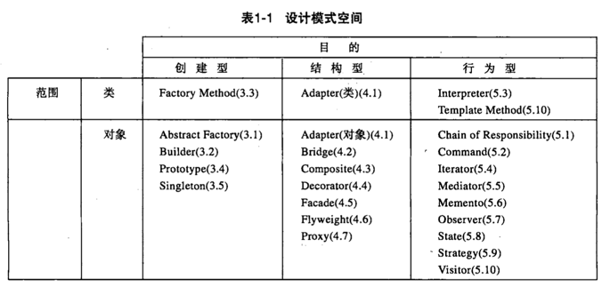

架构师之路：做一辈子小兵，不是目的，能够独当一面，构建自己的系统，创建可持续发展的产品，才是王道
架构是软件最重要的基本功之一，而设计模式就是其根本。

如何写作？  
结构化文档

# why
设计模式是某类场景下的最佳实践，如此可以构建健壮性更好的软件

# how

coding and minding 多动手，手脑并用，good for u

注意点：

分清楚是本DP是针对类的，还是对象

* DP 原则：SOLID

依赖倒置原则： 定义：高层模块不应该依赖低层模块，二者都应该依赖其抽象；抽象不应该依赖细节；细节应该依赖抽象。  
最常用的DP:

***

# 模式动机

## Create
* Abstract Factory
抽象工厂：提供一个接口，这个接口可以创建一系列相关对象或相互依赖的对象，而无需指定它们具体的类；

* Builder 
* Factory Method
* Singleton
* Prototype
## Structure

(ABCDFP)
* Adapter 将一个接口转换成客户希望的另一个接口，适配器模式使接口不兼容的那些类可以一起工作，其别名为包装器(Wrapper)。 
* Bridge 
* Composite
* Decorator
* Facade
* Proxy

## Behavior
(IT CCOSS)
DP for class
* Interpreter
* Template Method
*** 
DP for object
* Command
* Chain of Responsibility
* Observe
* State
* Strategy

模版方法： 它定义一个操作中的算法的骨架，而将一些步骤延迟到子类中。 模板方法使得子类可以不改变一个算法的结构即可重定义该算法的某些特定步骤的实现方式。

# 其它设计模式

* IOC 控制反转 买家 -> 市场平台 <-卖家 消费者(client caller) -> 容器框架 <- 生产者(suppler producer)
你的代码不再被直接调用，而是被框架调用，框架提供了骨架（通用代码），你提供肉（业务逻辑）就行了。
  
* DI(Dependecy Inject,依赖注入)是实现控制反转的一种设计模式，依赖注入就是将实例变量传入到一个对象中去。
https://www.zhihu.com/question/23277575/answer/169698662

# 总览

## other
Markdown 语法  https://www.runoob.com/markdown/md-lists.html  
* 换行：空格2次  

